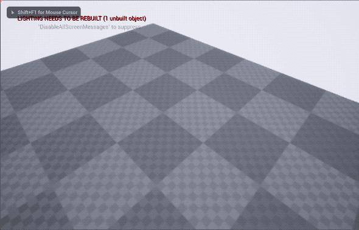

# UE4_TropicoCamera
A camera that works similar to Tropico, Simcity and other simulation/tycoon games

Made with ❤️ using Unreal Engine 4.24

## How to use

* Change your default **Pawn** and **PlayerController** to **BP_CameraPawn** and **BP_CameraController**
* Even better, you can change your default **GameMode** to **GM_CameraMode**
* You can tweak the speed of the camera and the minimum and maximum height in **BP_CameraController**
* Enjoy!